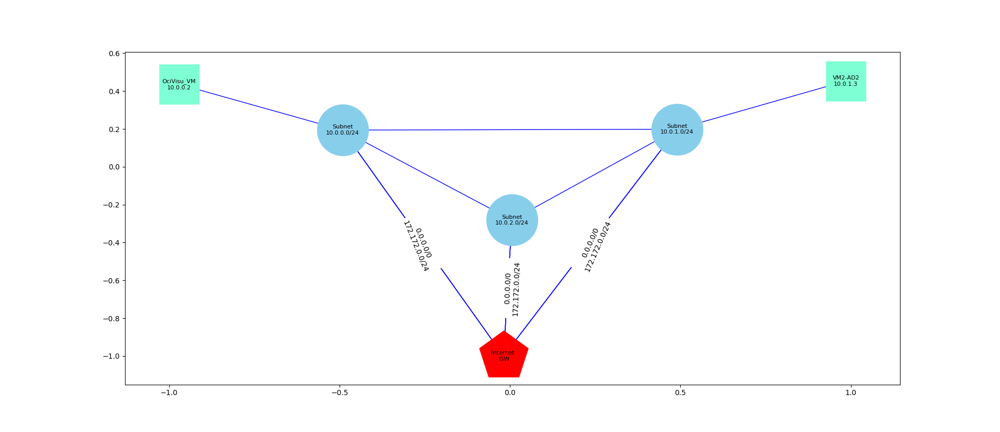

# OciVisuNet
## Introduction
I wrote this script to generate a graphical representation of Oracle Cloud Infrastructure (OCI) Virtual Cloud Network (VCN) with its different components including subnets, virtual machine instances, Internet gateways and Dynamic routing gateways. The following picture shows a sample of the script output:

## Requirements:
To use this script you need to install and configure OCI Cli flowing this link:
(https://github.com/oracle/oci-cli)
